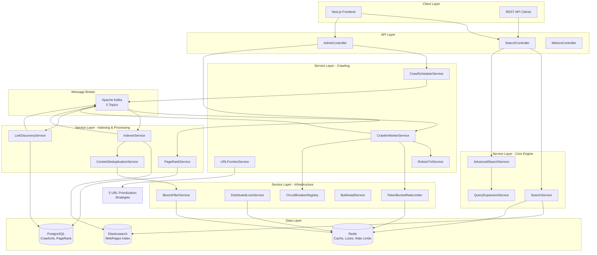
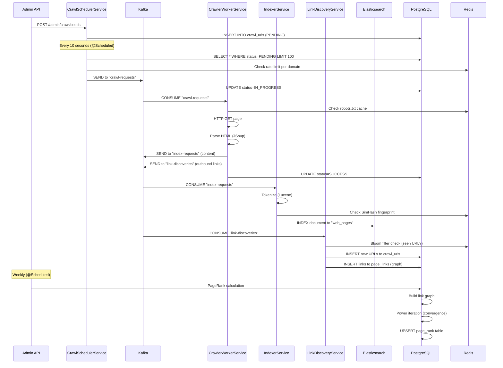
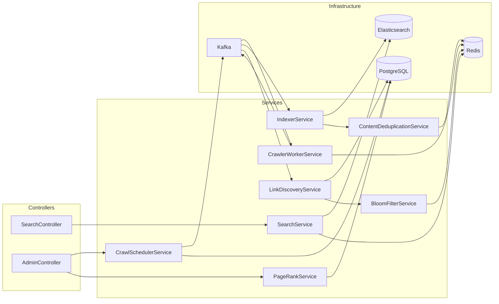

# 🎓 Backend Learning Guide - Enterprise Search Engine

> **Your Complete Roadmap to Understanding This Production-Grade Distributed Search Engine**

This guide will help you systematically understand how this backend works, from architecture to algorithms to implementation details.

---

## 📋 Table of Contents

1. [Architecture Overview](#architecture-overview)
2. [Technology Stack](#technology-stack)
3. [Project Structure](#project-structure)
4. [Core Components Map](#core-components-map)
5. [Data Flow & Event-Driven Architecture](#data-flow--event-driven-architecture)
6. [Reading Roadmap (Beginner → Advanced)](#reading-roadmap-beginner--advanced)
7. [Key Algorithms Explained](#key-algorithms-explained)
8. [Enterprise Patterns Used](#enterprise-patterns-used)
9. [Component Relationships](#component-relationships)
10. [FAQs & Common Confusions](#faqs--common-confusions)

---

## 🏗️ Architecture Overview

This is an **Event-Driven Microservices Architecture** built with Spring Boot. The system uses **Kafka** for asynchronous communication between components.

### High-Level System Flow



### Key Architectural Principles

1. **Separation of Concerns**: Controllers → Services → Repositories
2. **Event-Driven**: Asynchronous processing via Kafka
3. **Distributed by Design**: Redis for state, Kafka for coordination
4. **Resilience Patterns**: Circuit breakers, rate limiting, bulkheads
5. **Strategy Pattern**: Pluggable URL prioritization algorithms

---

## 🛠️ Technology Stack


## 📁 Project Structure

```
search-engine/src/main/java/com/chibao/edu/search_engine/
│
├── 📄 SearchEngineApplication.java    # Main entry point (Spring Boot)
│
├── 📂 controller/                     # REST API Layer (3 files)
│   ├── SearchController.java         # Search endpoints
│   ├── AdminController.java          # Admin/management endpoints
│   └── MetricsController.java        # Monitoring endpoints
│
├── 📂 service/                        # Business Logic Layer (17 files) ⭐
│   ├── 🔍 Search Services
│   │   ├── SearchService.java        # Core search with cache
│   │   ├── AdvancedSearchService.java # Advanced features
│   │   └── QueryExpansionService.java # Spell check, synonyms
│   │
│   ├── 🕷️ Crawling Services
│   │   ├── CrawlSchedulerService.java # Dispatches URLs to Kafka
│   │   ├── CrawlerWorkerService.java  # Fetches & parses pages
│   │   ├── URLFrontierService.java    # URL prioritization
│   │   ├── RobotsTxtService.java      # Robots.txt compliance
│   │   └── SitemapParserService.java  # Sitemap parsing
│   │
│   ├── 📑 Indexing Services
│   │   ├── IndexerService.java        # Indexes to Elasticsearch
│   │   └── LinkDiscoveryService.java  # Extracts & processes links
│   │
│   ├── 📊 Algorithms
│   │   ├── PageRankService.java       # Google PageRank algorithm
│   │   ├── ContentDeduplicationService.java # SimHash deduplication
│   │   └── BloomFilterService.java    # Fast URL deduplication
│   │
│   ├── 🛡️ Resilience & Infrastructure
│   │   ├── TokenBucketRateLimiter.java # Domain-based rate limiting
│   │   ├── DistributedLockService.java # Redlock implementation
│   │   ├── BulkheadService.java       # Resource isolation
│   │   └── URLNormalizationService.java # URL normalization
│   │
│   └── 📈 Monitoring
│       └── MonitoringService.java     # Custom metrics
│
├── 📂 strategy/                       # URL Prioritization Strategies (5 files)
│   ├── URLPrioritizationStrategy.java # Interface
│   ├── BFSStrategy.java               # Breadth-first search
│   ├── BestFirstStrategy.java         # PageRank-based priority
│   ├── OPICStrategy.java              # Online Page Importance Computation
│   └── FocusedCrawlingStrategy.java   # Topic-focused crawling
│
├── 📂 entity/                         # Domain Models (5 files)
│   ├── WebPage.java                   # Elasticsearch document
│   ├── CrawlUrl.java                  # PostgreSQL - crawl queue
│   ├── PageLink.java                  # PostgreSQL - link graph
│   ├── PageRankEntity.java            # PostgreSQL - PageRank scores
│   └── DomainMetadata.java            # PostgreSQL - domain stats
│
├── 📂 repository/                     # Data Access Layer (5 files)
│   ├── CrawlUrlRepository.java        # JPA repository
│   ├── PageLinkRepository.java        # JPA repository
│   ├── PageRankRepository.java        # JPA repository
│   ├── DomainMetadataRepository.java  # JPA repository
│   └── elasticsearch/
│       └── WebPageRepository.java     # Elasticsearch repository
│
├── 📂 dto/                            # Data Transfer Objects (8 files)
│   ├── request/
│   │   ├── CrawlRequest.java          # Kafka message for crawl
│   │   └── IndexRequest.java          # Kafka message for indexing
│   ├── response/
│   │   ├── CrawlResult.java           # Crawl result
│   │   └── LinkDiscoveryMessage.java  # Kafka message for links
│   └── search/
│       ├── SearchRequest.java         # Search query DTO
│       ├── SearchResponse.java        # Search response DTO
│       ├── SearchResult.java          # Single result DTO
│       └── ExpandedQuery.java         # Query expansion DTO
│
├── 📂 config/                         # Configuration (6 files)
│   ├── KafkaConfig.java               # Kafka producers/consumers
│   ├── KafkaTopics.java               # Topic constants ⭐
│   ├── RedisConfig.java               # Redis connection
│   ├── AsyncConfig.java               # Async execution
│   ├── CorsConfig.java                # CORS settings
│   └── OpenApiConfig.java             # Swagger/OpenAPI
│
├── 📂 components/                     # Utilities (1 file)
│   └── CircuitBreakerRegistry.java    # Circuit breaker management
│
├── 📂 monitoring/                     # Metrics (1 file)
│   └── MonitoringService.java         # Custom metrics
│
└── 📂 common/                         # Enums & Constants (1 file)
    └── CrawlStatus.java               # Enum: PENDING, IN_PROGRESS, SUCCESS, FAILED
```

### Files Count Summary

- **Total**: 53 Java classes
- **Controllers**: 3 (REST API endpoints)
- **Services**: 17 (core business logic)
- **Strategies**: 5 (URL prioritization algorithms)
- **Entities**: 5 (domain models)
- **Repositories**: 5 (data access)
- **DTOs**: 8 (data transfer objects)
- **Configuration**: 6 (app configuration)
- **Components**: 1 (utilities)
- **Monitoring**: 1 (metrics)
- **Common**: 1 (enums)

---

## 🎯 Core Components Map

### 1️⃣ **Controllers (API Layer)**

| Controller | Purpose | Key Endpoints |
|-----------|---------|---------------|
| [SearchController](file:///c:/Users/Admin/Desktop/projects/search-engine/search-engine/src/main/java/com/chibao/edu/search_engine/controller/SearchController.java) | Search API | `GET /api/v1/search?q=...`<br/>`GET /api/v1/search/suggestions?prefix=...` |
| [AdminController](file:///c:/Users/Admin/Desktop/projects/search-engine/search-engine/src/main/java/com/chibao/edu/search_engine/controller/AdminController.java) | Admin operations | `POST /api/v1/admin/crawl/seeds`<br/>`POST /api/v1/admin/pagerank/calculate` |
| [MetricsController](file:///c:/Users/Admin/Desktop/projects/search-engine/search-engine/src/main/java/com/chibao/edu/search_engine/controller/MetricsController.java) | Monitoring | `GET /api/v1/metrics` |

### 2️⃣ **Services (Business Logic)**

#### 🔍 Search Services

| Service | Responsibility | Key Methods |
|---------|---------------|-------------|
| [SearchService](file:///c:/Users/Admin/Desktop/projects/search-engine/search-engine/src/main/java/com/chibao/edu/search_engine/service/SearchService.java) | Execute search queries | `search()`, `getSuggestions()`, `clearCache()` |
| [AdvancedSearchService](file:///c:/Users/Admin/Desktop/projects/search-engine/search-engine/src/main/java/com/chibao/edu/search_engine/service/AdvancedSearchService.java) | Advanced search features | Complex queries, filters |
| [QueryExpansionService](file:///c:/Users/Admin/Desktop/projects/search-engine/search-engine/src/main/java/com/chibao/edu/search_engine/service/QueryExpansionService.java) | Query enhancement | Spell check, synonyms, entity detection |

#### 🕷️ Crawling Services

| Service | Responsibility | Key Methods |
|---------|---------------|-------------|
| [CrawlSchedulerService](file:///c:/Users/Admin/Desktop/projects/search-engine/search-engine/src/main/java/com/chibao/edu/search_engine/service/CrawlSchedulerService.java) | Manage crawl queue | `addSeedUrls()`, `dispatchPendingUrls()` (every 10s) |
| [CrawlerWorkerService](file:///c:/Users/Admin/Desktop/projects/search-engine/search-engine/src/main/java/com/chibao/edu/search_engine/service/CrawlerWorkerService.java) | HTTP fetching & parsing | `processCrawlRequest()` (Kafka consumer) |
| [URLFrontierService](file:///c:/Users/Admin/Desktop/projects/search-engine/search-engine/src/main/java/com/chibao/edu/search_engine/service/URLFrontierService.java) | URL prioritization | Manages priority queue with strategies |
| [RobotsTxtService](file:///c:/Users/Admin/Desktop/projects/search-engine/search-engine/src/main/java/com/chibao/edu/search_engine/service/RobotsTxtService.java) | Respect robots.txt | `isAllowed()`, parses robots files |
| [SitemapParserService](file:///c:/Users/Admin/Desktop/projects/search-engine/search-engine/src/main/java/com/chibao/edu/search_engine/service/SitemapParserService.java) | Parse XML sitemaps | Discovers URLs from sitemaps |

#### 📑 Indexing Services

| Service | Responsibility | Key Methods |
|---------|---------------|-------------|
| [IndexerService](file:///c:/Users/Admin/Desktop/projects/search-engine/search-engine/src/main/java/com/chibao/edu/search_engine/service/IndexerService.java) | Index to Elasticsearch | `processIndexRequest()` (Kafka consumer) |
| [LinkDiscoveryService](file:///c:/Users/Admin/Desktop/projects/search-engine/search-engine/src/main/java/com/chibao/edu/search_engine/service/LinkDiscoveryService.java) | Extract & filter links | `processDiscoveredLinks()` (Kafka consumer) |

#### 📊 Algorithm Services

| Service | Algorithm | Complexity |
|---------|----------|-----------|
| [PageRankService](file:///c:/Users/Admin/Desktop/projects/search-engine/search-engine/src/main/java/com/chibao/edu/search_engine/service/PageRankService.java) | Google PageRank | O(kN) where k=iterations, N=pages |
| [ContentDeduplicationService](file:///c:/Users/Admin/Desktop/projects/search-engine/search-engine/src/main/java/com/chibao/edu/search_engine/service/ContentDeduplicationService.java) | SimHash (locality-sensitive hashing) | O(n) for n tokens |
| [BloomFilterService](file:///c:/Users/Admin/Desktop/projects/search-engine/search-engine/src/main/java/com/chibao/edu/search_engine/service/BloomFilterService.java) | Bloom filter (probabilistic data structure) | O(k) for k hash functions |

#### 🛡️ Infrastructure Services

| Service | Pattern | Purpose |
|---------|---------|---------|
| [TokenBucketRateLimiter](file:///c:/Users/Admin/Desktop/projects/search-engine/search-engine/src/main/java/com/chibao/edu/search_engine/service/TokenBucketRateLimiter.java) | Rate Limiting | Domain-level politeness (Redis-backed) |
| [DistributedLockService](file:///c:/Users/Admin/Desktop/projects/search-engine/search-engine/src/main/java/com/chibao/edu/search_engine/service/DistributedLockService.java) | Distributed Lock | Redlock algorithm for coordination |
| [BulkheadService](file:///c:/Users/Admin/Desktop/projects/search-engine/search-engine/src/main/java/com/chibao/edu/search_engine/service/BulkheadService.java) | Bulkhead Pattern | Resource isolation |
| [CircuitBreakerRegistry](file:///c:/Users/Admin/Desktop/projects/search-engine/search-engine/src/main/java/com/chibao/edu/search_engine/components/CircuitBreakerRegistry.java) | Circuit Breaker | Fault tolerance (CLOSED/OPEN/HALF_OPEN) |

### 3️⃣ **Entities (Domain Models**)

| Entity | Storage | Purpose |
|--------|---------|---------|
| [WebPage](file:///c:/Users/Admin/Desktop/projects/search-engine/search-engine/src/main/java/com/chibao/edu/search_engine/entity/WebPage.java) | **Elasticsearch** | Indexed web page document |
| [CrawlUrl](file:///c:/Users/Admin/Desktop/projects/search-engine/search-engine/src/main/java/com/chibao/edu/search_engine/entity/CrawlUrl.java) | **PostgreSQL** | Crawl queue entry with status |
| [PageLink](file:///c:/Users/Admin/Desktop/projects/search-engine/search-engine/src/main/java/com/chibao/edu/search_engine/entity/PageLink.java) | **PostgreSQL** | Link graph (from_url → to_url) |
| [PageRankEntity](file:///c:/Users/Admin/Desktop/projects/search-engine/search-engine/src/main/java/com/chibao/edu/search_engine/entity/PageRankEntity.java) | **PostgreSQL** | PageRank scores |
| [DomainMetadata](file:///c:/Users/Admin/Desktop/projects/search-engine/search-engine/src/main/java/com/chibao/edu/search_engine/entity/DomainMetadata.java) | **PostgreSQL** | Domain-level statistics |

### 4️⃣ **Strategies (Pluggable Algorithms)**

All strategies implement [`URLPrioritizationStrategy`](file:///c:/Users/Admin/Desktop/projects/search-engine/search-engine/src/main/java/com/chibao/edu/search_engine/strategy/URLPrioritizationStrategy.java) interface.

| Strategy | Algorithm | Use Case |
|----------|-----------|----------|
| [BFSStrategy](file:///c:/Users/Admin/Desktop/projects/search-engine/search-engine/src/main/java/com/chibao/edu/search_engine/strategy/BFSStrategy.java) | Breadth-First Search | Equal priority for depth level |
| [BestFirstStrategy](file:///c:/Users/Admin/Desktop/projects/search-engine/search-engine/src/main/java/com/chibao/edu/search_engine/strategy/BestFirstStrategy.java) | PageRank-weighted | Prioritize authoritative pages |
| [OPICStrategy](file:///c:/Users/Admin/Desktop/projects/search-engine/search-engine/src/main/java/com/chibao/edu/search_engine/strategy/OPICStrategy.java) | Online Page Importance Computation | Real-time importance (cash model) |
| [FocusedCrawlingStrategy](file:///c:/Users/Admin/Desktop/projects/search-engine/search-engine/src/main/java/com/chibao/edu/search_engine/strategy/FocusedCrawlingStrategy.java) | Topic relevance | Domain-specific crawling |

---

## 🔄 Data Flow & Event-Driven Architecture

### Kafka Topics (5 Topics)

Defined in [`KafkaTopics.java`](file:///c:/Users/Admin/Desktop/projects/search-engine/search-engine/src/main/java/com/chibao/edu/search_engine/config/KafkaTopics.java):

```java
public static final String CRAWL_REQUESTS = "crawl-requests";    // Producer: Scheduler | Consumer: Worker
public static final String CRAWL_RESULTS = "crawl-results";      // Producer: Worker | Consumer: N/A (metrics)
public static final String INDEX_REQUESTS = "index-requests";    // Producer: Worker | Consumer: Indexer
public static final String LINK_DISCOVERIES = "link-discoveries"; // Producer: Worker | Consumer: LinkDiscovery
public static final String DEAD_LETTER_QUEUE = "crawl-dlq";      // Failed messages
```

### Complete Data Flow



### Key Points

1. **Asynchronous**: Crawling, indexing, link discovery happen independently
2. **Scalable**: Each Kafka consumer can scale horizontally
3. **Fault Tolerant**: Dead letter queue for failed messages
4. **Idempotent**: Bloom filters prevent duplicate crawls

---

## 🚀 Reading Roadmap (Beginner → Advanced)

### 📘 Level 1: Application Basics (Start Here!)

**Goal**: Understand how the application starts and what frameworks are used.

1. **[SearchEngineApplication.java](file:///c:/Users/Admin/Desktop/projects/search-engine/search-engine/src/main/java/com/chibao/edu/search_engine/SearchEngineApplication.java)** (28 lines)
   - 🎯 **Why**: Entry point, shows enabled features (@EnableKafka, @EnableScheduling, etc.)
   - 🔍 **What to notice**: Annotations enabling Kafka, JPA, Elasticsearch, Async

2. **[KafkaTopics.java](file:///c:/Users/Admin/Desktop/projects/search-engine/search-engine/src/main/java/com/chibao/edu/search_engine/config/KafkaTopics.java)** (13 lines)
   - 🎯 **Why**: Defines all Kafka topics used in event-driven architecture
   - 🔍 **What to notice**: 5 topics for different event types

3. **[CrawlStatus.java](file:///c:/Users/Admin/Desktop/projects/search-engine/search-engine/src/main/java/com/chibao/edu/search_engine/common/CrawlStatus.java)** (enum)
   - 🎯 **Why**: Understand crawl lifecycle states
   - 🔍 **What to notice**: PENDING → IN_PROGRESS → SUCCESS/FAILED

### 📗 Level 2: API Layer (REST Endpoints)

**Goal**: See how the outside world interacts with the system.

4. **[SearchController.java](file:///c:/Users/Admin/Desktop/projects/search-engine/search-engine/src/main/java/com/chibao/edu/search_engine/controller/SearchController.java)** (56 lines)
   - 🎯 **Why**: Handles search queries - the main user-facing feature
   - 🔍 **What to notice**: 
     - `GET /api/v1/search?q=...` → calls SearchService
     - Request/response DTOs
     - Swagger annotations for API docs

5. **[AdminController.java](file:///c:/Users/Admin/Desktop/projects/search-engine/search-engine/src/main/java/com/chibao/edu/search_engine/controller/AdminController.java)** (222 lines)
   - 🎯 **Why**: Management endpoints for crawling, PageRank, monitoring
   - 🔍 **What to notice**:
     - `POST /admin/crawl/seeds` - start crawling
     - `POST /admin/pagerank/calculate` - trigger algorithm
     - Statistics endpoints

### 📙 Level 3: Domain Models (Entities)

**Goal**: Understand what data is stored and where.

6. **[WebPage.java](file:///c:/Users/Admin/Desktop/projects/search-engine/search-engine/src/main/java/com/chibao/edu/search_engine/entity/WebPage.java)** (68 lines)
   - 🎯 **Why**: **Elasticsearch** document structure
   - 🔍 **What to notice**:
     - `@Document(indexName = "web_pages")` - stored in Elasticsearch
     - Fields: title, content, pageRank, tokens
     - `@Field(type = FieldType.Text)` vs `FieldType.Keyword`

7. **[CrawlUrl.java](file:///c:/Users/Admin/Desktop/projects/search-engine/search-engine/src/main/java/com/chibao/edu/search_engine/entity/CrawlUrl.java)** (75 lines)
   - 🎯 **Why**: **PostgreSQL** entity for crawl queue
   - 🔍 **What to notice**:
     - `@Entity @Table(name = "crawl_urls")` - JPA entity
     - Fields: url, urlHash (SHA-256), status, priority, depth
     - Indexes for performance

8. **[PageLink.java](file:///c:/Users/Admin/Desktop/projects/search-engine/search-engine/src/main/java/com/chibao/edu/search_engine/entity/PageLink.java)** + **[PageRankEntity.java](file:///c:/Users/Admin/Desktop/projects/search-engine/search-engine/src/main/java/com/chibao/edu/search_engine/entity/PageRankEntity.java)**
   - 🎯 **Why**: Understand link graph storage (for PageRank)

### 📕 Level 4: Search Flow

**Goal**: Trace a search query from request to response.

9. **[SearchService.java](file:///c:/Users/Admin/Desktop/projects/search-engine/search-engine/src/main/java/com/chibao/edu/search_engine/service/SearchService.java)** (213 lines)
   - 🎯 **Why**: Core search logic
   - 🔍 **Flow**:
     1. Normalize query
     2. Check Redis cache (30 min TTL)
     3. Build Elasticsearch query (bool query with boosting)
     4. Execute search
     5. Convert hits to DTOs
     6. Cache results
   - 🔍 **What to notice**:
     - `ElasticsearchOperations` for querying
     - Redis caching strategy
     - Boosting: title (3x) > tokens (2x) > content (1x)

10. **[IndexerService.java](file:///c:/Users/Admin/Desktop/projects/search-engine/search-engine/src/main/java/com/chibao/edu/search_engine/service/IndexerService.java)** (295 lines)
    - 🎯 **Why**: How pages get indexed to Elasticsearch
    - 🔍 **Flow**:
      1. Listen to Kafka topic `index-requests`
      2. Tokenize content (Lucene analyzer)
      3. Check for duplicates (SimHash)
      4. Generate snippet
      5. Index to Elasticsearch
    - 🔍 **What to notice**:
      - `@KafkaListener` for async processing
      - Lucene's `EnglishAnalyzer` (stemming, stopwords)

### 📘 Level 5: Crawling Flow

**Goal**: Understand how pages are discovered and fetched.

11. **[CrawlSchedulerService.java](file:///c:/Users/Admin/Desktop/projects/search-engine/search-engine/src/main/java/com/chibao/edu/search_engine/service/CrawlSchedulerService.java)** (267 lines)
    - 🎯 **Why**: Manages crawl queue in PostgreSQL
    - 🔍 **Flow**:
      1. `@Scheduled(fixedDelay = 10000)` - runs every 10s
      2. Query PENDING URLs from PostgreSQL
      3. Check domain rate limits (Redis)
      4. Send to Kafka `crawl-requests`
      5. Update status to IN_PROGRESS
    - 🔍 **What to notice**:
      - Domain-based rate limiting
      - Batch processing (100 URLs at a time)

12. **[CrawlerWorkerService.java](file:///c:/Users/Admin/Desktop/projects/search-engine/search-engine/src/main/java/com/chibao/edu/search_engine/service/CrawlerWorkerService.java)** (310 lines)
    - 🎯 **Why**: Does actual HTTP fetching
    - 🔍 **Flow**:
      1. Listen to Kafka `crawl-requests`
      2. Check robots.txt (via RobotsTxtService)
      3. Apply rate limiting (Token Bucket)
      4. HTTP GET with timeout
      5. Parse HTML (JSoup)
      6. Send content to `index-requests`
      7. Send links to `link-discoveries`
    - 🔍 **What to notice**:
      - Circuit breaker for fault tolerance
      - 30s timeout
      - Manual Kafka acknowledgment

13. **[LinkDiscoveryService.java](file:///c:/Users/Admin/Desktop/projects/search-engine/search-engine/src/main/java/com/chibao/edu/search_engine/service/LinkDiscoveryService.java)** (332 lines)
    - 🎯 **Why**: Processes discovered links
    - 🔍 **Flow**:
      1. Listen to Kafka `link-discoveries`
      2. Normalize URLs
      3. Filter (valid? blocked? already visited?)
      4. Bloom filter check (Guava)
      5. Insert to PostgreSQL crawl_urls + page_links

### 📗 Level 6: Advanced Algorithms

**Goal**: Understand sophisticated algorithms used.

14. **[PageRankService.java](file:///c:/Users/Admin/Desktop/projects/search-engine/search-engine/src/main/java/com/chibao/edu/search_engine/service/PageRankService.java)** (273 lines)
    - 🎯 **Why**: Implements Google's PageRank algorithm
    - 🔍 **Algorithm**:
      ```
      PR(A) = (1-d) + d × Σ(PR(Ti) / C(Ti))
      where d = 0.85 (damping factor)
      ```
    - 🔍 **Flow**:
      1. Build link graph from `page_links` table
      2. Initialize all pages with rank = 1.0 / N
      3. Iterate until convergence (max 100 iterations)
      4. Apply damping factor
      5. Store results in `page_rank` table
    - 🔍 **What to notice**:
      - Power iteration method
      - Convergence detection (δ < 0.0001)
      - Handles dangling nodes

15. **[BloomFilterService.java](file:///c:/Users/Admin/Desktop/projects/search-engine/search-engine/src/main/java/com/chibao/edu/search_engine/service/BloomFilterService.java)** (141 lines)
    - 🎯 **Why**: Fast URL deduplication (probabilistic data structure)
    - 🔍 **Specs**:
      - 10 million URLs capacity
      - 1% false positive rate
      - ~12MB memory usage
      - ~7 hash functions
    - 🔍 **Flow**:
      1. `mightContain(url)` - check if URL seen before
      2. If bloom says "maybe" → verify with Redis (2-layer check)
      3. `add(url)` - add to filter + Redis backup
    - 🔍 **What to notice**:
      - Guava's `BloomFilter` implementation
      - Redis as persistence layer

16. **[ContentDeduplicationService.java](file:///c:/Users/Admin/Desktop/projects/search-engine/search-engine/src/main/java/com/chibao/edu/search_engine/service/ContentDeduplicationService.java)** (387 lines)
    - 🎯 **Why**: Detect near-duplicate content (SimHash algorithm)
    - 🔍 **Algorithm**:
      1. Tokenize content with TF-IDF weights
      2. Hash each token to 64-bit
      3. Build weighted vector
      4. Collapse to 64-bit fingerprint
      5. Compare fingerprints (Hamming distance ≤ 3)
    - 🔍 **What to notice**:
      - Locality-sensitive hashing
      - O(1) duplicate detection
      - Lucene analyzer for tokenization

### 📙 Level 7: Resilience Patterns

**Goal**: Learn enterprise-grade fault tolerance techniques.

17. **[TokenBucketRateLimiter.java](file:///c:/Users/Admin/Desktop/projects/search-engine/search-engine/src/main/java/com/chibao/edu/search_engine/service/TokenBucketRateLimiter.java)**
    - 🎯 **Why**: Implement per-domain politeness
    - 🔍 **Algorithm**:
      - Token bucket: refills at fixed rate
      - Consume token per request
      - Block if bucket empty
    - 🔍 **What to notice**:
      - Redis Lua scripts for atomicity
      - 5 seconds between requests per domain

18. **[CircuitBreakerRegistry.java](file:///c:/Users/Admin/Desktop/projects/search-engine/search-engine/src/main/java/com/chibao/edu/search_engine/components/CircuitBreakerRegistry.java)**
    - 🎯 **Why**: Prevent cascading failures
    - 🔍 **States**:
      - CLOSED (normal) → OPEN (failed) → HALF_OPEN (testing) → CLOSED
    - 🔍 **What to notice**:
      - Failure threshold: 5 failures
      - Open duration: 60 seconds

19. **[DistributedLockService.java](file:///c:/Users/Admin/Desktop/projects/search-engine/search-engine/src/main/java/com/chibao/edu/search_engine/service/DistributedLockService.java)**
    - 🎯 **Why**: Coordinate across multiple instances
    - 🔍 **Algorithm**: Redlock (Redis-based distributed lock)
    - 🔍 **What to notice**:
      - `SET resource_name unique_id NX PX 30000`
      - Auto-expiry prevents deadlocks

### 📕 Level 8: URL Prioritization Strategies

**Goal**: Understand pluggable crawling strategies (Strategy Pattern).

20. **[BFSStrategy.java](file:///c:/Users/Admin/Desktop/projects/search-engine/search-engine/src/main/java/com/chibao/edu/search_engine/strategy/BFSStrategy.java)** vs **[BestFirstStrategy.java](file:///c:/Users/Admin/Desktop/projects/search-engine/search-engine/src/main/java/com/chibao/edu/search_engine/strategy/BestFirstStrategy.java)** vs **[OPICStrategy.java](file:///c:/Users/Admin/Desktop/projects/search-engine/search-engine/src/main/java/com/chibao/edu/search_engine/strategy/OPICStrategy.java)**
    - 🎯 **Why**: Different crawling objectives need different strategies
    - 🔍 **Comparison**:
      
      | Strategy | Formula | Use Case |
      |----------|---------|----------|
      | **BFS** | `priority = MAX_PRIORITY - depth` | Broad coverage |
      | **BestFirst** | `priority = pageRank × 100` | Quality over quantity |
      | **OPIC** | Cash model (dynamic) | Real-time importance |
      | **Focused** | Topic relevance score | Domain-specific |

---

## 🧠 Key Algorithms Explained

### 1. PageRank Algorithm

**File**: [PageRankService.java](file:///c:/Users/Admin/Desktop/projects/search-engine/search-engine/src/main/java/com/chibao/edu/search_engine/service/PageRankService.java)

**Formula**:
```
PR(A) = (1-d) + d × Σ(PR(Ti) / C(Ti))

where:
- PR(A) = PageRank of page A
- d = 0.85 (damping factor - probability user follows a link)
- Ti = pages linking to A
- C(Ti) = number of outbound links from Ti
```

**Conceptual Explanation**:
> Imagine you're randomly clicking links on the web. PageRank is the probability you'll land on a page. High-authority sites (like Wikipedia) have higher PageRank because many other pages link to them.

**Implementation Steps**:
1. Build link graph from `page_links` table
2. Initialize: `PR(page) = 1.0 / total_pages`
3. Iterate (max 100 times):
   ```java
   newRank = (1 - 0.85) + 0.85 × Σ(inboundRank / outboundCount)
   ```
4. Check convergence: `|newRank - oldRank| < 0.0001`
5. Store final ranks in `page_rank` table

**Time Complexity**: O(k × E) where k = iterations, E = edges in graph

---

### 2. SimHash (Content Deduplication)

**File**: [ContentDeduplicationService.java](file:///c:/Users/Admin/Desktop/projects/search-engine/search-engine/src/main/java/com/chibao/edu/search_engine/service/ContentDeduplicationService.java)

**Problem**: How to detect near-duplicate pages (e.g., mirrors, copies)?

**Solution**: Locality-Sensitive Hashing
- Similar documents → similar fingerprints
- Hamming distance ≤ 3 bits → considered duplicate

**Algorithm**:
```
1. Tokenize content → ["search", "engine", "distributed", ...]
2. Calculate TF-IDF weight for each term
3. Hash each term to 64-bit: h("search") = 10110101...
4. Build weighted vector:
   - For each bit position:
     - If hash bit = 1 → add weight
     - If hash bit = 0 → subtract weight
5. Collapse to fingerprint:
   - bit[i] = 1 if vector[i] > 0 else 0
6. Compare: hammingDistance(fp1, fp2) = count differing bits
```

**Example**:
```
Page A: "search engine java"     → fingerprint: 11010110...
Page B: "search engine python"   → fingerprint: 11010010...
Hamming distance = 1 (differ in 1 bit) → DUPLICATE!
```

**Time Complexity**: O(n) for n tokens

---

### 3. Bloom Filter (URL Deduplication)

**File**: [BloomFilterService.java](file:///c:/Users/Admin/Desktop/projects/search-engine/search-engine/src/main/java/com/chibao/edu/search_engine/service/BloomFilterService.java)

**Problem**: Check if URL was crawled before (10M URLs → too much memory)

**Solution**: Probabilistic data structure
- **No false negatives** (if it says "no", definitely new)
- **1% false positives** (if it says "yes", verify with Redis)

**How it works**:
```
1. Create bit array of size m
2. Use k hash functions (k ≈ 7 for 1% FPR)
3. To add URL:
   - hash(url) → 7 bit positions
   - Set all 7 bits to 1
4. To check URL:
   - hash(url) → 7 bit positions
   - If ANY bit is 0 → definitely new!
   - If ALL bits are 1 → might be duplicate (verify)
```

**Memory**: 10M URLs × 10 bits/element = ~12MB (vs 640MB for HashSet)

---

### 4. Token Bucket Rate Limiting

**File**: [TokenBucketRateLimiter.java](file:///c:/Users/Admin/Desktop/projects/search-engine/search-engine/src/main/java/com/chibao/edu/search_engine/service/TokenBucketRateLimiter.java)

**Problem**: Don't overload target servers (politeness)

**Solution**: Token bucket algorithm
```
Bucket: [5 tokens] → refills 1 token/5s
Request: consume 1 token
If empty: wait
```

**Redis Implementation** (Lua script for atomicity):
```lua
local tokens = redis.call('GET', key) or bucket_size
if tokens > 0 then
  redis.call('DECRBY', key, 1)
  return 1  -- success
else
  return 0  -- rate limited
end
```

**Domain-based**: Each domain has its own bucket (avoids blocking all crawling if one site is slow)

---

### 5. Circuit Breaker Pattern

**File**: [CircuitBreakerRegistry.java](file:///c:/Users/Admin/Desktop/projects/search-engine/search-engine/src/main/java/com/chibao/edu/search_engine/components/CircuitBreakerRegistry.java)

**Problem**: If one domain is down, don't keep trying (waste resources)

**State Machine**:
```
CLOSED (normal)
  ↓ (5 consecutive failures)
OPEN (block all requests)
  ↓ (after 60 seconds)
HALF_OPEN (try 1 request)
  ↓ success → CLOSED
  ↓ failure → OPEN
```

**Benefits**:
- Fast failure (don't wait for timeout)
- Auto-recovery
- Resource protection

---

## 🏛️ Enterprise Patterns Used

### 1. Event-Driven Architecture (EDA)

**Pattern**: Asynchronous communication via Kafka

**Benefits**:
- Loose coupling (services don't call each other directly)
- Scalability (scale consumers independently)
- Fault tolerance (Kafka persists messages)

**Topics**:
```
crawl-requests   → Worker consumes
index-requests   → Indexer consumes
link-discoveries → LinkDiscovery consumes
```

---

### 2. Strategy Pattern

**Pattern**: Pluggable algorithms for URL prioritization

**Interface**: `URLPrioritizationStrategy`

**Implementations**: BFS, BestFirst, OPIC, Focused

**Benefits**:
- Easy to switch strategies at runtime
- Clean separation of concerns
- Open/Closed Principle (add new strategies without modifying existing code)

**Usage**:
```java
// Change strategy via admin endpoint
POST /api/v1/admin/frontier/strategy?strategy=OPIC
```

---

### 3. Repository Pattern

**Pattern**: Abstraction over data access

**Examples**:
- `CrawlUrlRepository` → PostgreSQL
- `WebPageRepository` → Elasticsearch

**Benefits**:
- Testability (mock repositories)
- Separation between domain and data layers

---

### 4. Scheduled Tasks

**Pattern**: Background jobs with `@Scheduled`

**Examples**:
```java
@Scheduled(fixedDelay = 10000)  // Every 10s
public void dispatchPendingUrls() { ... }

@Scheduled(cron = "0 0 2 * * SUN")  // Sundays at 2 AM
public void scheduledPageRankCalculation() { ... }
```

**Benefits**:
- Automatic execution
- No manual triggers needed

---

### 5. Distributed Locking (Redlock)

**Pattern**: Redis-based distributed lock

**Use Case**: Prevent multiple instances from doing PageRank calculation simultaneously

**Implementation**:
```java
boolean acquired = lockService.tryLock("pagerank-calc", 300);
if (acquired) {
  try {
    // Do work
  } finally {
    lockService.unlock("pagerank-calc");
  }
}
```

---

## 🔗 Component Relationships

### Dependency Graph



### Service Dependencies Summary

| Service | Depends On | Reason |
|---------|-----------|--------|
| SearchService | Elasticsearch, Redis | Query engine, caching |
| CrawlSchedulerService | PostgreSQL, Kafka, Redis | Queue, messaging, rate limits |
| CrawlerWorkerService | Kafka, Redis | Consume requests, cache robots.txt |
| IndexerService | Kafka, Elasticsearch | Consume requests, index documents |
| LinkDiscoveryService | Kafka, PostgreSQL, Redis | Consume links, store in DB, Bloom filter |
| PageRankService | PostgreSQL | Read link graph, store ranks |
| BloomFilterService | Redis | Persist filter state |
| ContentDeduplicationService | Redis, Elasticsearch | Store fingerprints, query docs |

---

## ❓ FAQs & Common Confusions

### Q1: Why both PostgreSQL AND Elasticsearch?

**A**: Different purposes!

| Storage | Use Case | Query Type |
|---------|----------|-----------|
| **PostgreSQL** | Crawl queue, link graph, PageRank | Relational queries, transactions |
| **Elasticsearch** | Web page content | Full-text search, ranking |

**Example**:
- "Find all PENDING URLs for domain 'example.com'" → PostgreSQL (structured query)
- "Search for 'distributed systems' in content" → Elasticsearch (full-text search)

---

### Q2: Why use Kafka instead of direct service calls?

**A**: Async event-driven benefits!

**Without Kafka**:
```
Crawler → calls Indexer directly
Problem: If Indexer is down, crawler fails
```

**With Kafka**:
```
Crawler → sends message to Kafka → Indexer consumes when ready
Benefit: Crawler doesn't care if Indexer is down
```

**Other benefits**:
- **Scale independently**: 10 crawlers → 1 indexer OR 1 crawler → 10 indexers
- **Replay**: If indexer crashes, messages are still in Kafka
- **Loose coupling**: Services don't know about each other

---

### Q3: What's the difference between Bloom Filter and SimHash?

| Feature | Bloom Filter | SimHash |
|---------|-------------|---------|
| **Purpose** | URL deduplication | Content deduplication |
| **Input** | URL string | Full page content |
| **Output** | Boolean (seen/not seen) | 64-bit fingerprint |
| **Accuracy** | 1% false positives | Hamming distance threshold |
| **Use Case** | "Did we crawl this URL?" | "Is this page a copy?" |

**Example**:
- Same URL, different content → Bloom says "duplicate", SimHash says "unique" ✅
- Different URLs, same content → Bloom says "unique", SimHash says "duplicate" ✅

---

### Q4: Why scheduled tasks instead of manual triggers?

**A**: Automation & reliability!

**Scheduled Tasks**:
```java
@Scheduled(fixedDelay = 10000)  // Every 10 seconds
public void dispatchPendingUrls() {
  // Automatically fetch PENDING URLs and send to Kafka
}
```

**Benefits**:
- No human intervention needed
- Runs continuously
- Catches URLs that failed before (retry logic)

---

### Q5: How does the distributed lock prevent duplicate PageRank calculations?

**A**: Redis atomic operations!

**Scenario**: 3 instances of the service running

**Without lock**:
```
Instance 1: Start PageRank calculation (100K pages)
Instance 2: Start PageRank calculation (same 100K pages) ❌ WASTE!
Instance 3: Start PageRank calculation (same 100K pages) ❌ WASTE!
```

**With Redlock**:
```
Instance 1: tryLock("pagerank") → SUCCESS → calculate
Instance 2: tryLock("pagerank") → FAIL (locked by 1) → skip
Instance 3: tryLock("pagerank") → FAIL (locked by 1) → skip
```

**Redis Command**:
```
SET pagerank-lock instance-1-uuid NX PX 300000
(only succeeds if key doesn't exist, expires in 5 min)
```

---

### Q6: Why is PageRank calculated weekly, not real-time?

**A**: Performance trade-off!

**Complexity**: O(k × N × E) where:
- k = iterations (usually 20-100)
- N = number of pages
- E = number of edges (links)

**For 1M pages with 10M links**:
- Calculation time: ~30 seconds
- Locks page_link table during read
- Computationally expensive

**Solution**: Weekly batch job (`@Scheduled(cron = "0 0 2 * * SUN")`) at low-traffic time.

---

### Q7: How does the circuit breaker know when to open?

**A**: Failure counter!

**State Machine**:
```java
// Closed (normal)
if (failure_count >= 5) {
  state = OPEN;
  open_timestamp = now();
}

// Open (blocking)
if (now() - open_timestamp > 60_seconds) {
  state = HALF_OPEN;
  trial_count = 0;
}

// Half-Open (testing)
if (request_succeeds) {
  state = CLOSED;
  failure_count = 0;
} else {
  state = OPEN;
}
```

**Visualization**:
```
CLOSED          OPEN            HALF_OPEN
[✓✓✓✓✓]  →  [✗✗✗✗✗]  (wait 60s)  →  [?]
normal       blocked            test 1 request
             (5 failures)        ↓ success → CLOSED
                                 ↓ failure → OPEN
```

---

## 🎓 Next Steps

### 🔹 To Deepen Understanding

1. **Run the project**: See it in action!
   ```bash
   docker-compose up -d
   mvn spring-boot:run
   ```

2. **Add logging**: See event flow
   ```java
   log.info("Processing URL: {}", url);
   ```

3. **Debug with breakpoints**: Step through code in IntelliJ/VS Code

4. **Read tests**: See component behavior
   ```
   search-engine/src/test/
   ```

5. **Check Swagger UI**: Explore API
   ```
   http://localhost:8080/swagger-ui.html
   ```

### 🔹 To Extend the Project

1. **Add new URL prioritization strategy**
   - Implement `URLPrioritizationStrategy`
   - Register in `URLFrontierService`

2. **Add query suggestions** (autocomplete)
   - Elasticsearch completion suggester
   - Prefix queries

3. **Add crawler politeness rules**
   - Parse `Crawl-delay` from robots.txt
   - Respect `sitemap.xml`

4. **Add content classification**
   - ML model for spam detection
   - Topic categorization

5. **Add distributed tracing**
   - Spring Cloud Sleuth + Zipkin
   - Trace requests across Kafka topics

---

## 📚 Additional Resources

### Official Documentation

- [Spring Boot Reference](https://docs.spring.io/spring-boot/docs/current/reference/html/)
- [Apache Kafka](https://kafka.apache.org/documentation/)
- [Elasticsearch Guide](https://www.elastic.co/guide/en/elasticsearch/reference/current/index.html)
- [Redis Commands](https://redis.io/commands)

### Algorithm Papers

- **PageRank**: ["The PageRank Citation Ranking: Bringing Order to the Web"](http://ilpubs.stanford.edu:8090/422/) - Lawrence Page et al.
- **SimHash**: ["Detecting Near-Duplicates for Web Crawling"](http://www.wwwconference.org/www2007/papers/paper215.pdf) - Charikar
- **Bloom Filters**: ["Space/Time Trade-offs in Hash Coding with Allowable Errors"](https://dl.acm.org/doi/10.1145/362686.362692) - Burton Bloom

### Related Topics

- [Crawling at Scale](https://www.aosabook.org/en/distsys.html)
- [Search Engine Architecture](https://nlp.stanford.edu/IR-book/)
- [Distributed Systems Patterns](https://microservices.io/patterns/index.html)

---

## ✅ Summary Checklist

After reading this guide, you should be able to:

- [ ] Explain the overall system architecture (Kafka event-driven)
- [ ] Trace a search query from API to Elasticsearch
- [ ] Trace a crawl request through the pipeline
- [ ] Understand how PageRank is calculated
- [ ] Explain SimHash vs Bloom Filter differences
- [ ] Describe circuit breaker states
- [ ] Understand strategy pattern for URL prioritization
- [ ] Explain why both PostgreSQL and Elasticsearch are used
- [ ] Describe rate limiting mechanism (token bucket)
- [ ] Understand distributed locking with Redis

---

**Happy learning! 🚀**

If you have questions or want to dive deeper into specific topics, let me know!
